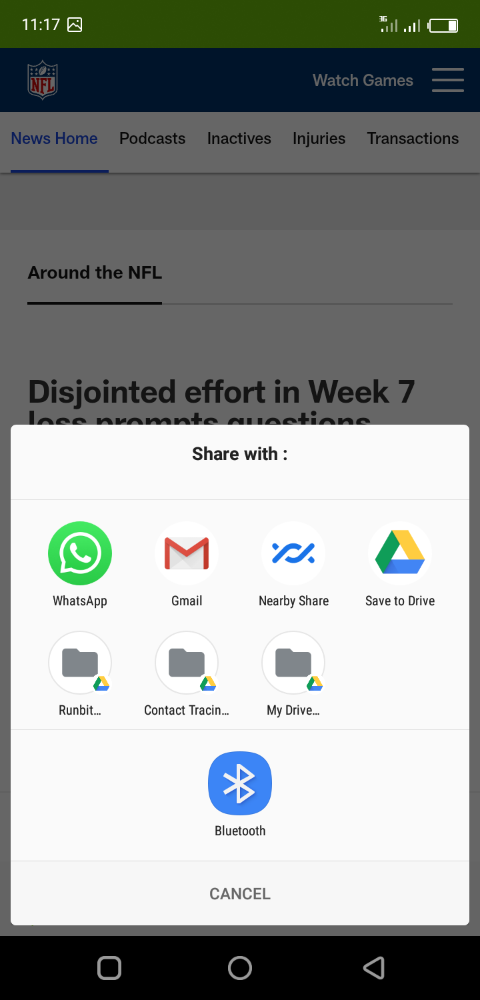

# NewsApp
Android news application using MVVM architecture pattern. Fetches data from https://newsapi.org/

Android NewsApp developed with MVVM Architecture

### Architecture
 MVVM Architecture

## Dependancies
- Retrofit
- Coroutines
- Viewmodel and LiveData
- Glide

### Api
 baseUrl (https://newsapi.org/)

 ### ScreenShots
   
  
    

